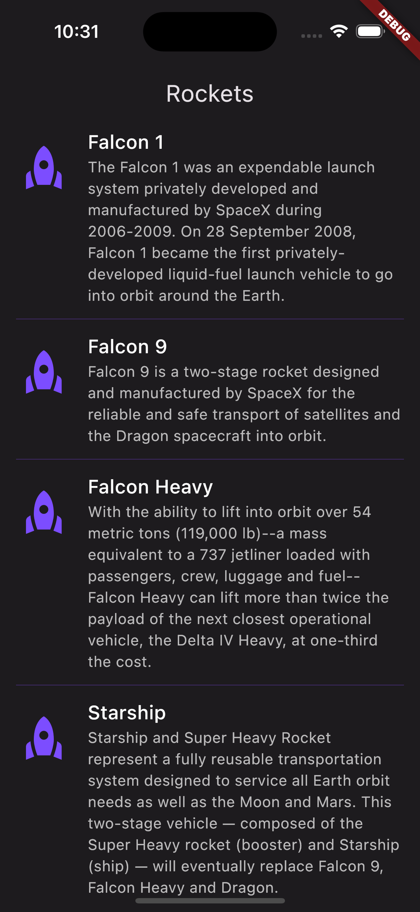
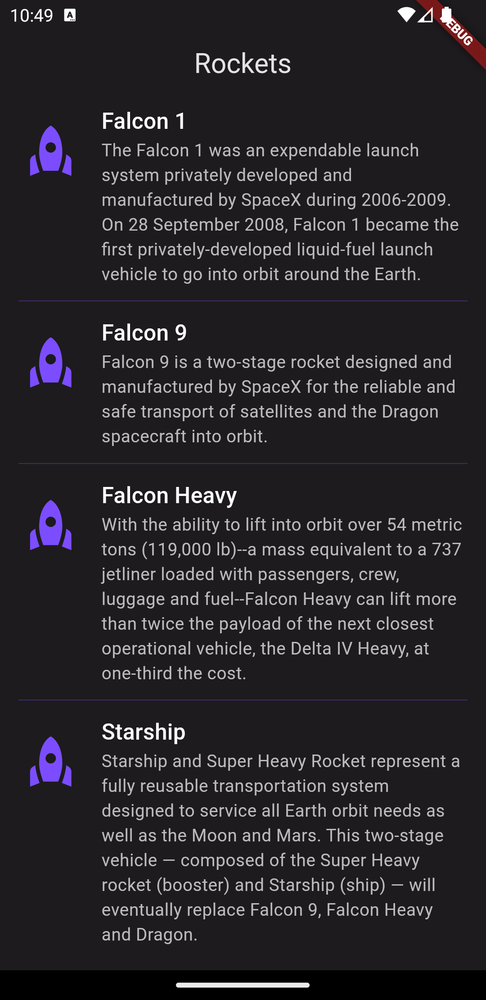

# SpaceX

Consume the SpaceX GraphQL API to display the rocket list. Using the packages bloc, graphql_flutter, graphql_codegen.

# Packages

- bloc: ^8.1.0
- equatable: ^2.0.5
- flutter_bloc: ^8.1.1
- very_good_analysis: ^3.1.0

# Installation

## Cloning the repository

```sh
git clone https://github.com/axielroque/flutter_bloc_graphql_codegen.git

cd flutter_bloc_graphql_codegen
```

## Install packages

```sh
flutter pub get
```

# Demo

|  </img> |  </img> |
| ------------------------------------------- | ----------------------------------------------- |
